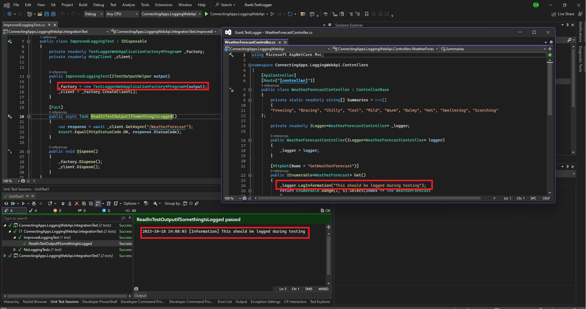

# Xunit.TestLogger

## Before this NuGet package
If you make [integration tests](https://learn.microsoft.com/en-us/aspnet/core/test/integration-tests?view=aspnetcore-7.0) with [xUnit](https://xunit.net/), your logging is gone. You can just see if the test succeeds or fails but you cannot see why as you don't have the logging to help you understanding what happened during the runtime of the test, which makes it hard to solve it.

## Now
The is situation is different now! The problem is solved for .NET 6, .NET 7 and .NET 8. Alle you need to do is stop using this way of creating a `WebApplicationFactory`:

```csharp
public NoLoggingTest()
{
    _factory = new WebApplicationFactory<Program>();
}
```

and start using this way

```csharp
public ImprovedLoggingTest(ITestOutputHelper output)
{
    _factory = new TestLoggerWebApplicationFactory<Program>(output);
}
```
Here is how it looks like:

[Link To ScreenShot](https://github.com/ConnectingApps/Xunit.TestLogger/blob/main/ScreenForLogging.png?raw=true)



## In Detail

Assume you have the following controller method (just the method from the template in Visual Studio with some logging added):

```csharp
[HttpGet(Name = "GetWeatherForecast")]
public IEnumerable<WeatherForecast> Get()
{
    // first do some logging
    _logger.LogInformation("This should be logged during testing");
    // Then return an object like it is done in the VS Template
    return Enumerable.Range(1, 5).Select(index => new WeatherForecast
    {
        Date = DateTime.Now.AddDays(index),
        TemperatureC = Random.Shared.Next(-20, 55),
        Summary = Summaries[Random.Shared.Next(Summaries.Length)]
    })
    .ToArray();
}
```

then you can test it like this:
```csharp
using ConnectingApps.Xunit.TestLogger;
using System.Net;
using Xunit.Abstractions;

namespace ConnectingApps.LoggingWebApi.IntegrationTest
{
    public class ImprovedLoggingTest : IDisposable
    {
        private readonly TestLoggerWebApplicationFactory<Program> _factory;
        private readonly HttpClient _client;


        public ImprovedLoggingTest(ITestOutputHelper output)
        {
            _factory = new TestLoggerWebApplicationFactory<Program>(output);
            _client = _factory.CreateClient();
        }

        [Fact]
        public async Task ReadInTestOutputIfSomethingIsLogged()
        {
            var response = await _client.GetAsync("/WeatherForecast");
            Assert.Equal(HttpStatusCode.OK, response.StatusCode);
        }

        public void Dispose()
        {
            _factory.Dispose();
            _client.Dispose();
        }
    }
}
```
 As a result, "This should be logged during testing" will be shown in the test output.


